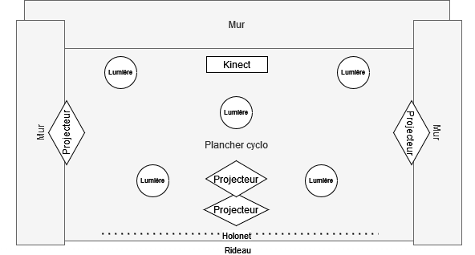

# Holonet

## Concept
Projection de vidéos et d'images en hologramme afin de créer un univers relaxe
### Thème
La nostalgie

## Inspirations
### Technique
  
Vidéo: https://youtu.be/WFkZjTCxVPc?si=YtvipODYRm8tzLlg

  
Source: https://youtu.be/HyX6MRs506M?si=6FSUl2lLWOaZ2Nn8  
 

### Artistique

### Conceptuelle

https://github.com/im-boyo/testa_radovanovic_felix_holonet/assets/89608091/3f1ac834-c73b-443b-9a3f-4d33c1d0216a

https://github.com/im-boyo/testa_radovanovic_felix_holonet/assets/89608091/1b8e0fd1-d65f-464f-bdf0-820e7d03ebad

Source: https://www.pinterest.ca/imboyo_/project-holonet/  

## Origine
Le fantôme de Pepper  
  
  
Source: https://fr.wikipedia.org/wiki/Fant%C3%B4me_de_Pepper   

## Idée en lien avec le projet
- Utiliser le cyclo du grand studio
- Utiliser le filet comme quatrième mur pour projeter
- Créer un univers 360 
  
Source: https://www.showtex.com/en/products/flame-retardant-textiles/scrim-netting-gauze/pepperscrim

- Animation qui joue quand on s'approche d'un mur
- Lumière sur sol pour dire à l'interacteur où se placer
- Tracking du positionnement de la lumière avec Max    
  
  
  
  

## Problèmes possibles
- Obtenir un filet Pepperscrim (Prix) - Compagnie contactée
- Savoir comment utiliser un filet Pepperscrim (Nouveau matériel, installation) - Tutoriels, aide de l'enseignant
